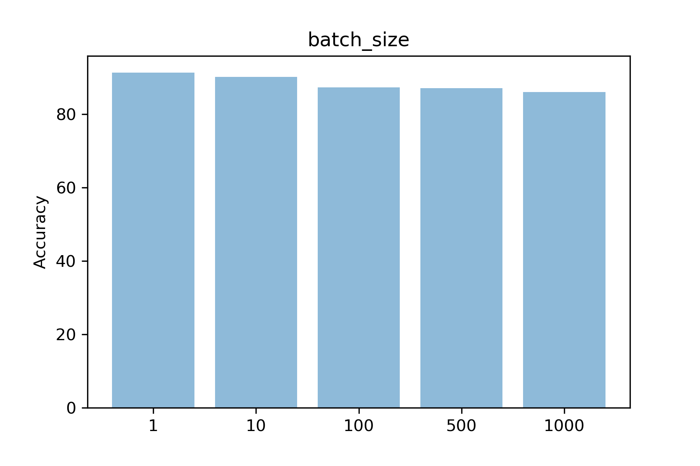
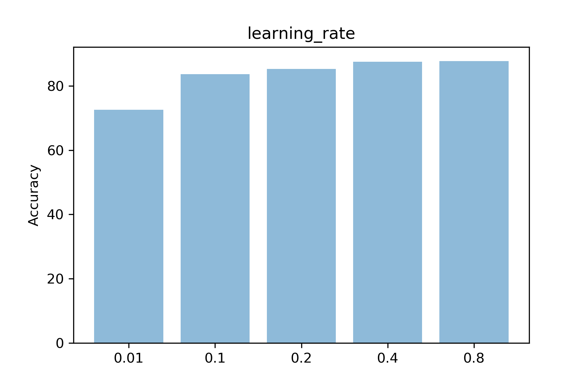

# Impact of the variation of hyper-parameters in artificial neural networks
[Anthony Sébert](mailto:antoine.sb@orange.fr)[^1] , october 2018

## Abstract

The recent global interest in the artificial intelligence domain bring with him a whole area of interesting new challenges and techniques. With the power of bayesian inferences, powerful statistical methods, machine learning appears as one of the key domains to solve tomorrow's problems in a world where AIs will be part of everyday's life, hidden from our eyes yet monitoring and operating our environment.
This paper will discuss the impact on the results of the variation of the **hyper-parameters** in supervised learning using an **Artificial Neural Network**[^2], the **k-Nearest Neighbour**[^3], and a combination of both. The implementation will be written in Python 3.7[^4], widely adopted in scientific computing in general and in artificial intelligence in particular[^5][^6], and the 2D plotting library matplotlib[^7] to visualize the results.

## Categories and subject Descriptors

**Computing methodologies~Neural networks**
Computing methodologies~Supervised learning by classification
Computing methodologies~Supervised learning by regression

## Comparative study setup

To complete this study, two datasets were selected :
- MNIST[^10] dataset (commonly used in machine learning)
  * **task** : recognise handwritten digits
  * **key properties** : 60.000 entries for the *training set*, 10.000 entries for the *testing set*, each one being a label and an array of 28x28 bytes (a byte representing a pixel of the digit's image)
  * **strategy**
    * the *training set* and *testing set* are already provided
- "Red and White Wine Quality EDA"[^8][^9] dataset
  * **task** : determine the influence of each chemical properties on the mark of a wine
  * **key properties** : 1.500 entries, each containing 11 chemical properties and three marks from 0 to 10
  * **strategy**
    * since the datasets contain an important number of entries, we can consider the statistical noise very low, and hence perform a min-max scaling (normalisation) on the data (for all properties, $\displaystyle value_{min} = 0$ and $\displaystyle value_{max} = 10$)
    * we split the file into two datasets : *training set* and *testing set* with a **80:20** split ratio

## Neural network

### Implementation

See [src/ann.ipynb#Implementation](src/ann.ipynb#Implementation) for the implementation of the artificial neural network.

### Hyperparameters

There are several hyperparameters that impact the performance of an artificial neural network. The number of *epochs* is closely linked to the neural network accuracy : the higher it is, the more correct will be the results, but the more time it will take. Concerning the *batch size*, its increase reduce the number of errors, but increase the memory space needed as well. Since the network topology is quite simple, it does not have to be trained a lot, so the *learning rate* can be low, ensuring as well to avoid overshooting. Other variants of SGD have been considered (AdaGrad or AdaDelta), but will not be part of this coursework due to a lack of time and experience [^11][^12][^13].

------

Carry out an evaluation to study each of these hyper-parameters on the basic
neural network (implemented in lab 3) and for each of the 2 data sets, and the
optimal hyper-parameter settings for:

* Number of epochs
* Learning rate
* Batch size

A graph should be provided for each, comparing at least five different values
for each hyperparameter. The y-axis of the graph should be accuracy, while the
x-axis is devoted to the parameter setting.

------

#### MNIST dataset

##### Epochs

The study will be carried upon the following values (with the default value in bold) : 1, 10, **100**, 1000, 10000

##### Batch size

The study will be carried upon the following values (with the default value in bold) : 1, 10, **100**, 200, len(mnist_train_list)

**Note**
The selected values have covered the approaches *Stochastic Gradient Descent*, *mini_batch* and *Gradient Decent*.

##### Learning rate

The study will be carried upon the following values (with the default value in bold) : 0.01, 0.1, **0.2**, 0.4, 0.8

#### "Red and White Wine Quality EDA" dataset

##### Epochs

The study will be carried upon the following values (with the default value in bold) : 1, 10, **100**, 1000, 10000

##### Batch size

The study will be carried upon the following values (with the default value in bold) : 1, 10, **100**, 200, len(mnist_train_list)

**Note**
The selected values have covered the approaches *Stochastic Gradient Descent*, *mini_batch* and *Gradient Decent*.

##### Learning rate

The study will be carried upon the following values (with the default value in bold) : 0.01, 0.1, **0.2**, 0.4, 0.8

### Discussion of results

-----

A paragraph should then be provided to discuss the results, and to explain why you think the parameter is optimal in these conditions. You should consider reporting your results using sentences such as: "we can see that with increasing epochs the overall accuracy of the model decreased on dataset X because *your reason* whilst in dataset Y we observe that *your observation* etc.

------

...

## k-nearest neighbour

### Hyperparameters 

-----

Provide one paragraph detailing your understanding of the kNN algorithm, the role of the hyper-parameter k and the differences between unweighted and weighted voting in kNN.

------

...

### Discussion of results

-----

A second paragraph should be provided, discussing the results and your understanding of them. For example, an extemporized version of 'weighted kNN has less meaning at lower values of k, so we do not observe  much improvement in performance. However, at higher values of k we can see improved performance as it is able to consider information relevance based upon neighbour distance'.

------

...

## Hybrid

### Combining ANN and k-NN

-----

Using the optimal parameters from previous parts of the coursework; develop a hybrid system which improves data representation. The idea is that you make use of the hidden layer activation for each training instance and use that as input into the kNN.

This should be introduced with a paragraph discussing how you modified the ANN code to access the hidden layer representation. You may also want to include a figure to help your explanation. Detailed code should not be included; instead include the ipynb in your zip file.

------

...

### Visualisation of results

-----

A table should be provided, comparing accuracy of the hybrid system against the kNN and neural network. This will demonstrate that the improvement in representation over the course of training is due to improved representation as gained from the network. You can present the results for each of your datasets using a table (or graph).

------

...

### Discussion of results

-----

Provide a paragraph to discuss your results. If improvements (or performance deteriorations) are noticed, then consider “why” to provide astute observations.

------

...

## References

[^1]: Computer Science student at [The Robert Gordon university](https://www.rgu.ac.uk/) (Garthdee House, Garthdee Road, Aberdeen, AB10 7QB, Scotland, United Kingdom)
[^2]: McCulloch, W.S., Pitts, W., 1943. A logical calculus of the ideas immanent in nervous activity. The Bulletin of Mathematical Biophysics 5, 115–133. doi:10.1007/BF02478259
[^3]: Fukunage, K., Narendra, P.M., 1975. A Branch and Bound Algorithm for Computing k-Nearest Neighbors. IEEE Transactions on Computers C-24, 750–753. doi:10.1109/T-C.1975.224297
[^4]: [Official Python 3.x documentation](https://docs.python.org/3/)
[^5]: python.org. 2018. PythonForArtificialIntelligence - Python Wiki. [ONLINE] Available at: https://wiki.python.org/moin/PythonForArtificialIntelligence. [Accessed 10 October 2018].
[^6]: Russell, S., Norvig, P., 2009. Artificial Intelligence: A Modern Approach, 3rd edition, Pearson. doi:10.1017/S0269888900007724
[^7]: [Official website of the project](https://matplotlib.org/)
[^8]: Kaggle.com. 2017. Red and White Wine Quality | Kaggle. [ONLINE] Available at: https://www.kaggle.com/danielpanizzo/red-and-white-wine-quality/notebook. [Accessed 10 October 2018].
[^9]: Cortez, P., Cerdeira, A., Almeida, F., Matos, T., Reis, J., 2009. Modeling wine preferences by data mining from physicochemical properties. Decision Support Systems 47, 547–553. doi:10.1016/j.dss.2009.05.016
[^10]: yann.lecun.com. ????. MNIST handwritten digit database, Yann LeCun, Corinna Cortes and Chris Burges. [ONLINE] Available at: http://yann.lecun.com/exdb/mnist/. [Accessed 10 October 2018].
[^11]: Scikit-learn.org. (2018). Choosing the right estimator — scikit-learn 0.20.0 documentation. [online] Available at: http://scikit-learn.org/stable/tutorial/machine_learning_map/ [Accessed 22 Oct. 2018].
[^12]: Brownlee, J. (2018). How To Improve Deep Learning Performance. [online] Machine Learning Mastery. Available at: https://machinelearningmastery.com/improve-deep-learning-performance/ [Accessed 22 Oct. 2018].
[^13]: rate, C. (2018). Choosing a learning rate. [online] Data Science Stack Exchange. Available at: https://datascience.stackexchange.com/questions/410/choosing-a-learning-rate [Accessed 22 Oct. 2018].