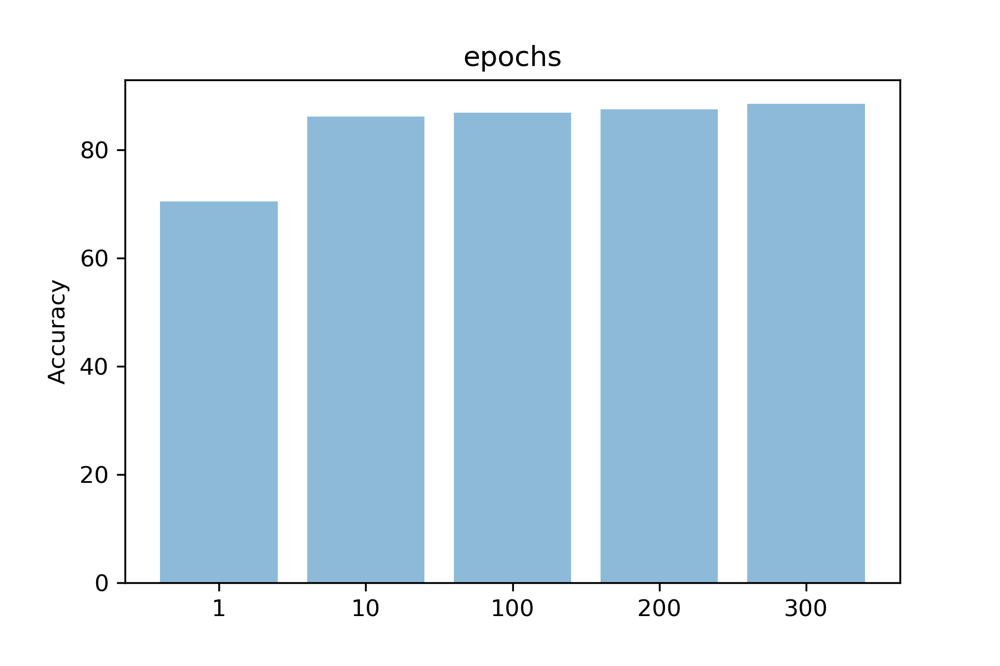

# Impact of the variation of hyper-parameters in artificial neural networks

[Anthony Sébert](mailto:antoine.sb@orange.fr)[^1] , october 2018

## Abstract

The recent global interest in the artificial intelligence domain bring with him a whole area of interesting new challenges and techniques. With the power of bayesian inferences, powerful statistical methods, machine learning appears as one of the key domains to solve tomorrow's problems in a world where AIs will be part of everyday's life, hidden from our eyes yet monitoring and operating our environment.
This paper will discuss the impact on the results of the variation of the **hyper-parameters** in supervised learning using an **Artificial Neural Network**[^2]. The implementation will be written in Python 3.7[^3], widely adopted in scientific computing in general and in artificial intelligence in particular[^4][^5], and the 2D plotting library matplotlib[^6] to visualize the results.

## Categories and subject Descriptors

**Computing methodologies~Neural networks**

Computing methodologies~Supervised learning by classification

Computing methodologies~Supervised learning by regression

## Comparative study setup

To complete this study, two datasets were selected :
- MNIST[^7] dataset (commonly used in machine learning)
  * **task** : recognise handwritten digits
  * **key properties** : 60.000 entries for the *training set*, 10.000 entries for the *testing set*, each one being a label and an array of 28x28 bytes (a byte representing a pixel of the digit's image)
  * **strategy**
    * the *training set* and *testing set* are already provided
- "Red and White Wine Quality EDA"[^8][^9] dataset
  * **task** : determine the influence of each chemical properties on the mark of a wine
  * **key properties** : 1.500 entries, each containing 11 chemical properties and three marks from 0 to 10
  * **strategy**
    * since the datasets contain an important number of entries, we can consider the statistical noise very low, and hence perform a min-max scaling (normalisation) on the data (for all properties, $\displaystyle value_{min} = 0$ and $\displaystyle value_{max} = 10$)
    * we split the file into two datasets : *training set* and *testing set* with a **80:20** split ratio

## Neural network

### Implementation

See [src/ann.ipynb#Implementation](src/ann.ipynb#Implementation) for the implementation of the artificial neural network.

### Hyperparameters

There are several hyperparameters that impact the performance of an artificial neural network. The number of *epochs* is closely linked to the neural network accuracy : the higher it is, the more correct will be the results, but the more time it will take. Concerning the *batch size*, its increase is supposed reduce the number of errors, but increase the memory space needed as well. Since the network topology is quite simple, it does not have to be trained a lot, so the *learning rate* can be low, ensuring as well to avoid overshooting. Other variants of SGD have been considered (AdaGrad or AdaDelta), but will not be part of this coursework due to a lack of time and experience [^10][^11][^12].

#### MNIST dataset

See [src/ann.ipynb#MNIST dataset](src/ann.ipynb#MNIST dataset) for the implementation of the tests.
The figures below have been directly exported from the code.

##### Epochs

The study will be carried upon the following values (with the default value in bold) : 1, 10, **100**, 200, 300

##### Batch size

The study will be carried upon the following values (with the default value in bold) : 1, 10, **100**, 500, len(mnist_train_list)

**Note**
The selected values have covered the approaches *Stochastic Gradient Descent*, *mini_batch* and *Gradient Decent*.

##### Learning rate

The study will be carried upon the following values (with the default value in bold) : 0.01, 0.1, **0.2**, 0.4, 0.8

#### "Red and White Wine Quality EDA" dataset

See [src/ann.ipynb#"Red and White Wine Quality EDA" dataset](src/ann.ipynb#"Red and White Wine Quality EDA" dataset) for the implementation of the tests.
The figures below have been directly exported from the code.

##### Epochs

The study will be carried upon the following values (with the default value in bold) : 1, 10, **100**, 200, 300

##### Batch size

The study will be carried upon the following values (with the default value in bold) : 1, 10, **100**, 200, len(mnist_train_list)

**Note**
The selected values have covered the approaches *Stochastic Gradient Descent*, *mini_batch* and *Gradient Decent*.

##### Learning rate

The study will be carried upon the following values (with the default value in bold) : 0.01, 0.1, **0.2**, 0.4, 0.8

### Discussion of results

As we can see, the neural network is quite *learning rate*-sensitive, since there is a significant correlation between its value and the total accuracy. Of course, very low values such as *0.01* produce a poorly result. Moreover, the number of epochs seems to have a deep impact on the overall accuracy : the higher it is, the more the neural network is able to guess right, even if it increases the computation time linearly (which in this case quickly becomes problematic). Note that this parameter seems to have a "*log(n)*" impact : at some point, the network becomes insensitive. Considering the batch size, it seems that the stochastic gradient descent is the best approach, ensuring as well a low memory footprint.

## References

[^1]: Computer Science student at [The Robert Gordon university](https://www.rgu.ac.uk/) (Garthdee House, Garthdee Road, Aberdeen, AB10 7QB, Scotland, United Kingdom)

[^2]: McCulloch, W.S., Pitts, W., 1943. A logical calculus of the ideas immanent in nervous activity. The Bulletin of Mathematical Biophysics 5, 115–133. doi:10.1007/BF02478259

[^3]: [Official Python 3.x documentation](https://docs.python.org/3/)

[^4]: python.org. 2018. PythonForArtificialIntelligence - Python Wiki. [ONLINE] Available at: https://wiki.python.org/moin/PythonForArtificialIntelligence. [Accessed 10 October 2018].

[^5]: Russell, S., Norvig, P., 2009. Artificial Intelligence: A Modern Approach, 3rd edition, Pearson. doi:10.1017/S0269888900007724

[^6]: [Official website of the project](https://matplotlib.org/)

[^7]: yann.lecun.com. ????. MNIST handwritten digit database, Yann LeCun, Corinna Cortes and Chris Burges. [ONLINE] Available at: http://yann.lecun.com/exdb/mnist/. [Accessed 10 October 2018].

[^8]: Kaggle.com. 2017. Red and White Wine Quality | Kaggle. [ONLINE] Available at: https://www.kaggle.com/danielpanizzo/red-and-white-wine-quality/notebook. [Accessed 10 October 2018].

[^9]: Cortez, P., Cerdeira, A., Almeida, F., Matos, T., Reis, J., 2009. Modeling wine preferences by data mining from physicochemical properties. Decision Support Systems 47, 547–553. doi:10.1016/j.dss.2009.05.016

[^10]: Scikit-learn.org. (2018). Choosing the right estimator — scikit-learn 0.20.0 documentation. [online] Available at: http://scikit-learn.org/stable/tutorial/machine_learning_map/ [Accessed 22 Oct. 2018].

[^11]: Brownlee, J. (2018). How To Improve Deep Learning Performance. [online] Machine Learning Mastery. Available at: https://machinelearningmastery.com/improve-deep-learning-performance/ [Accessed 22 Oct. 2018].

[^12]: rate, C. (2018). Choosing a learning rate. [online] Data Science Stack Exchange. Available at: https://datascience.stackexchange.com/questions/410/choosing-a-learning-rate [Accessed 22 Oct. 2018].
